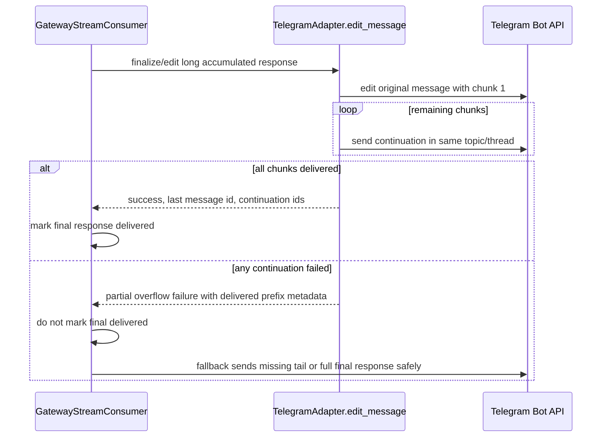

# fix：阻止 Telegram 流式回复在首个溢出分片之后终止

## 摘要

修复一个 Telegram gateway bug：在 topic 中，一段较长的流式 assistant 回复
会在首个溢出分片之后表现出"答案中途停止"的现象。所报告的截图显示，在
`Nehemiah - Coding` Telegram topic 中，一段较长的 Hermes 响应结束于
`- The visible tool-call summary`，随后用户指出前一条消息并未完成对该
Telegram topic 的流式推送。

本计划针对的是流式 edit 溢出路径，而不是通用的模型生成。一段已完成的
assistant 响应，要么必须通过所有 continuation 消息完整地送达 Telegram，
要么必须留下足够的状态，让 gateway 的 fallback 路径来投递剩余内容，
而不是在只完成部分投递后就标记该 turn 已完成。

---

## 问题框架

Telegram 将消息文本限制为 4096 个 UTF-16 code unit。Hermes 通过编辑一条
消息来流式推送 gateway 响应，当流式消息增长超过该限制时，把溢出部分拆分到
额外的 Telegram 消息中。该 adapter 已有针对超大 edit 的拆分投递路径，但
部分 continuation 失败的契约较弱：如果分片 1 成功编辑而后续某个 continuation
失败，adapter 仍可能针对整个操作报告成功。于是 stream consumer 可能会将
最终响应标记为已投递，即便可见的 topic 中只包含第一部分。

这一问题在 Telegram forum topic 中尤为明显，因为一段较长的最终响应可能被
拆分到工具进度气泡之下，而一个缺失的 continuation 看起来与"流在答案中途
停止"完全一样。

---

## 需求

- R1. 较长的流式 Telegram 回复必须在所有溢出分片中保留全部最终内容。
- R2. 如果首个溢出 edit 落地之后有任何 continuation 分片失败，gateway
  不得将最终响应标记为已完全投递。
- R3. Continuation 分片必须保持路由到与原始响应相同的 Telegram
  topic/thread。
- R4. 该修复必须避免在所有溢出分片都已成功投递时重复发送完整答案。
- R5. 测试必须覆盖所报告的失败形态：一段超出 Telegram 限制的最终流式回复，
  在首次 edit 时成功，在某个 continuation 上失败，且不得被视为已完成。

---

## 关键技术决策

- 把溢出投递视为"要么全部完成，否则视为未完成"。`_edit_overflow_split`
  只有在每一个计划分片都送达 Telegram 时，才应返回成功（最终投递完成）的
  结果。部分投递是一种独立的 outcome，下游代码可以从中恢复。
- 通过 `SendResult.raw_response` 携带部分溢出元数据，而不是新增一个公开
  dataclass 字段——除非实现证明既有结果结构不够用。stream consumer 已经
  在 adapter edit 之后检视 `SendResult`，因此一个轻量的 raw response 契约
  可以让改动保持收敛。
- 让 stream consumer 负责最终投递真相。adapter 知道哪些分片落地了，但
  consumer 才拥有 `_final_response_sent`、`_final_content_delivered`、
  `_fallback_prefix` 以及 fallback 最终发送行为。
- 将路由保持在 Telegram adapter helper 内部。Continuation 发送应继续使用
  `_thread_kwargs_for_send(...)`，携带由元数据派生的 `message_thread_id`
  和 reply anchors，以便 forum topic 行为保持一致。

---

## 高层技术设计

---

## 实现单元

### U1. 为 Telegram edit 拆分新增部分溢出契约

**目标：** 让 `TelegramAdapter._edit_overflow_split` 区分完整的溢出投递与
部分投递。

**需求：** R1, R2, R4

**依赖：** 无

**文件：**
- `gateway/platforms/telegram.py`
- `tests/gateway/test_telegram_send.py` 或现有的、已覆盖 `edit_message`
  溢出行为的 Telegram adapter 测试模块

**方法：**
- 在所有分片都已投递时保持成功路径不变：返回
  `SendResult(success=True, message_id=<last chunk>, continuation_message_ids=(...))`。
- 当首个 edit 之后某个 continuation 失败时，返回一个明确表示部分投递的
  结果，而不是简单的成功。优先使用 `success=False`、`retryable=True`，
  并在 `raw_response` 元数据中带上：已投递分片数、总分片数、最后已投递的
  message id、以及可见的已投递前缀。
- 保留日志，但不要把日志作为唯一信号。调用方必须能够判断部分投递发生过。
- 确保首个被 edit 的分片以及所有成功的 continuation 分片仍保留既有的
  Markdown/纯文本 fallback 行为。

**遵循的模式：**
- `TelegramAdapter.edit_message` 与 `_edit_overflow_split` 中既有的溢出处理。
- `gateway/platforms/base.py` 中既有的 `SendResult` 语义，尤其是
  `retryable`、`raw_response` 和 `continuation_message_ids`。

**测试场景：**
- 超大的最终化 edit，所有 continuation 都成功时返回 success、最后一个
  continuation id 以及所有 continuation id。
- 超大的最终化 edit，首个 continuation 发送失败时返回部分溢出失败，且不
  报告成功。
- 超大的最终化 edit，某个 continuation 成功而后续某个 continuation 失败时，
  在 raw 元数据中报告最后已投递的 continuation id 和已投递数量。
- continuation 的 MarkdownV2 格式化失败时，仍先重试纯文本，然后才视为
  投递失败。

**验证：** Adapter 测试证明完整溢出仍成功，且部分溢出可被调用方观察到。

### U2. 让 stream consumer 能从部分溢出中恢复

**目标：** 确保部分 Telegram 溢出不会在完整响应到达用户之前就设置
`_final_response_sent` 或 `_final_content_delivered`。

**需求：** R1, R2, R4, R5

**依赖：** U1

**文件：**
- `gateway/stream_consumer.py`
- `tests/gateway/test_stream_consumer.py` 或一个聚焦的新文件
  `tests/gateway/test_stream_consumer_telegram_overflow.py`

**方法：**
- 在 `_send_or_edit` 中，当 `adapter.edit_message(...)` 返回部分溢出失败时，
  更新 consumer 状态以反映最后可见的前缀/消息，并进入针对缺失内容的
  fallback 投递。
- 不要把 `_already_sent` 当作最终投递。部分可见消息可以为真，而最终投递
  可以为假。
- 如果可用，使用已投递前缀元数据，使 `_send_fallback_final(...)` 只发送
  缺失的尾部。如果实现中发现 Markdown 格式化后前缀不可靠，优先将完整最终
  响应作为一条新的 fallback 消息发送，而不是静默丢弃尾部。
- 当 adapter 已投递所有分片时，保留对 `continuation_message_ids` 既有的
  成功处理。

**遵循的模式：**
- `GatewayStreamConsumer._send_or_edit` 与 `_send_fallback_final` 中既有的
  fallback 模式。
- 围绕 `_final_response_sent`、`_final_content_delivered` 和
  `_fallback_prefix` 的既有注释（涉及过往的部分投递回归）。

**测试场景：**
- 一段溢出且收到完整成功 edit 拆分的最终流式响应，会设置最终投递标志，且
  不触发 fallback。
- 一段 adapter 报告部分溢出的最终流式响应，不会立即设置最终投递标志。
- 部分溢出之后，fallback 投递发送剩余尾部，并仅在 fallback 发送成功时才
  标记最终内容已投递。
- 如果 fallback 投递也失败，consumer 将最终投递保持为 false，以便 gateway
  的非流式最终发送安全路径仍能运行。

**验证：** Stream consumer 测试通过模拟"首分片可见且 continuation 失败"
复现截图中的形态，然后断言最终答案未被抑制。

### U3. 为溢出与 fallback continuation 保留 Telegram topic/thread 路由

**目标：** 确保溢出恢复消息落到同一个 Telegram forum topic 或 DM topic
fallback 上下文中。

**需求：** R3

**依赖：** U1, U2

**文件：**
- `gateway/platforms/telegram.py`
- `gateway/stream_consumer.py`
- `tests/gateway/test_stream_consumer_thread_routing.py`
- 相关的 Telegram adapter 路由测试（如果既有覆盖更贴近此处）

**方法：**
- 在每个溢出 continuation 和 fallback 发送中都持续传递 `metadata`。
- 在有效处保留 reply anchors，但不要让缺失的 reply anchor 在普通 forum
  topic 中丢掉 `message_thread_id`。
- 对于私聊 DM topic 的 fallback 元数据，保留 adapter 注释中记录的、既有的
  更严格 anchor 行为。

**遵循的模式：**
- `TelegramAdapter._thread_kwargs_for_send(...)`。
- 围绕 Telegram topic 恢复和 stream consumer thread routing 的既有测试。

**测试场景：**
- 溢出 continuation 在 forum topic 中包含 `message_thread_id`。
- 在 `reply message not found` 之后进行 continuation 重试时，在允许情况下
  保留 forum topic 路由。
- 部分溢出 fallback 发送会收到与原始 stream consumer 相同的元数据。

**验证：** Thread-routing 断言检视 fake bot 调用，确认所有
continuation/fallback 消息都携带预期的 topic 元数据。

### U4. 添加 issue 证据与 PR body 可追溯性

**目标：** 让上游 issue 与 PR 清晰地追溯用户可见的 bug 与验证证据。

**需求：** R5

**依赖：** U1, U2, U3

**文件：**
- 通过 `gh issue create` 创建的 GitHub issue body
- 使用 `.github/PULL_REQUEST_TEMPLATE.md` 的 PR body

**方法：**
- 创建一个带截图证据的 GitHub issue：在 `Nehemiah - Coding` Telegram
  topic 中那段较长的消息停在 `- The visible tool-call summary`，以及用户
  回复说前一条消息未完成对该 Telegram topic 的流式推送。
- 将受影响组件标注为 Gateway，平台标注为 Telegram。
- 在 PR body 中用 `Fixes #...` 链接该 issue，描述拆分投递契约变更，并
  附上截图，或在 GitHub 上传可用时附上图片。
- 严格遵循 `CONTRIBUTING.md` 与仓库 PR 模板。

**遵循的模式：**
- `.github/ISSUE_TEMPLATE/bug_report.yml`
- `.github/PULL_REQUEST_TEMPLATE.md`

**测试场景：**
- 测试预期：无，这是 tracker 与 PR 文档工作。

**验证：** GitHub issue 存在且带截图证据或明确的截图引用，且 PR body
链接了 issue 并列出了所运行的测试。

---

## 范围边界

### 在范围内

- Telegram 流式响应溢出拆分与恢复。
- 针对部分溢出投递的 stream consumer 最终投递真相。
- 溢出与 fallback continuation 发送的 topic/thread 元数据保留。
- 围绕 adapter 与 stream consumer 行为的聚焦单元测试。

### 在范围外

- 修改 `run_agent.py` 中的模型流式语义。
- 重做 Telegram draft streaming——它是 DM 专属，不是截图中 forum topic 路径。
- 修改 Discord、Slack、WhatsApp 或 Matrix 的通用平台消息拆分，除非为修复
  Telegram 必须更正某个共享 helper。
- 修改工具进度显示设置或终端进度渲染。

### 延后至后续工作

- 跨所有消息平台的、更广泛的 gateway 投递完整性可观测性。
- 针对先前被截断响应的、面向用户的重发/恢复命令。

---

## 风险与缓解措施

- 风险：fallback 恢复会重复已可见的首批分片。缓解：在可靠处使用已投递前缀
  元数据，并为"完整成功不重复"行为添加测试。
- 风险：在丢弃无效 reply anchors 的同时保留 forum topic 路由，容易回归。
  缓解：为 `message_thread_id` 与 reply 行为加入 fake bot 调用断言。
- 风险：MarkdownV2 格式化会改变可见/原始前缀对比。缓解：让 fallback 保持
  保守；重复内容优于静默缺失内容，但测试应让常见路径只发送尾部。

---

## 来源与研究

- 用户提供的截图，位于 `/root/.hermes/image_cache/img_f664e68f6ddf.jpg`。
- `gateway/stream_consumer.py` 中的流式 edit、溢出、fallback 与最终投递状态
  处理。
- `gateway/platforms/telegram.py` 中的 Telegram send/edit 溢出拆分与 topic
  routing helpers。
- `gateway/platforms/base.py` 中的 `SendResult` 契约与共享消息分块 helper。
- `tests/gateway/test_stream_consumer.py`、
  `tests/gateway/test_stream_consumer_thread_routing.py` 以及 Telegram
  adapter 测试，用于聚焦的回归覆盖。

---

## 验证策略

- 运行聚焦的 Telegram adapter 溢出测试。
- 运行聚焦的 stream consumer 溢出/fallback 测试。
- 运行受元数据变更影响的 topic-routing 测试。
- 运行围绕 Telegram send/edit、stream consumer 以及（如触及）run progress
  的 gateway 测试子集。
- 在创建 PR 之前，确保 `git diff` 仅包含与本 bug 相关的计划、实现、测试以及
  PR/issue 相关文档。
